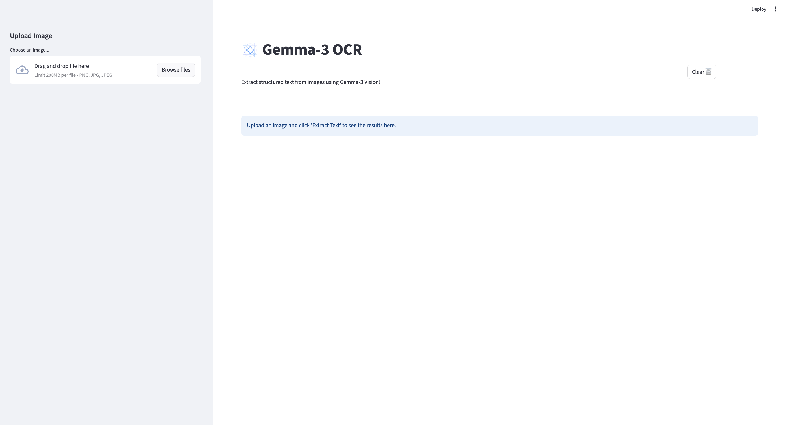

# Gemma-3 OCR

Gemma-3 OCR is a simple, interactive Streamlit app that extracts and formats readable text from images using the `gemma3:12b` vision model via the [Ollama](https://ollama.com) framework.

## Aim of the project / What I'm trying to accomplish 

The project could be used as a stepping stone into devoloping advanced document digitization frameworks , where bulk of documents/ handwritten notes could be easily converted into digitized content.  
The project also aims to assist with invoice & recipt processing . 


## Preview

<p align="center">
  
</p>

## Pre-requisites


1. Install ollama in your system . 

- macOS
  ```bash
    brew install ollama
  ```

- Linux
  ```bash
    curl -fsSL https://ollama.com/install.sh | sh
  ```

2. Download the Gemma-3 Model
   ```bash
    ollama pull gemma3:12b
    ```

## Setup

1. Clone the repository 
   ```bash
    git clone git@github.com:Akhilesh0013/Gemma-3-OCR.git
    ```

2. Create and Activate virtual environment 
   ```
    python -m venv .venv
    source .venv/bin/activate 
    ```

3. Install Dependencies
   ```
    pip install -r requirements.txt
    ```

4. Start ollama (if you have'nt already) : This downloads and by default starts the ollama server at http://localhost:11434 . If already downloaded in the local system , it just starts the model . 
   ```
   ollama pull gemma3:12b
    ```

5. Run the Streamlit App
   ```
   streamlit run app.py
    ```


   
## Acknowledgements
- Built using Streamlit
- Powered by Ollama and the gemma3:12b model
